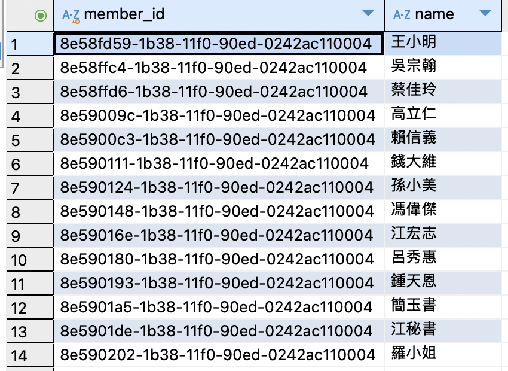
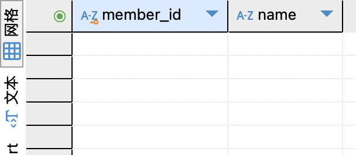

### 查詢與效能運算練習
#### 題目 1-1
**列出「過去 6 個月未曾進場過的會員」的 member_id 與 name。**
* 可使用三種典型解法：`NOT IN`、`NOT EXISTS`、以及 `LEFT JOIN ... IS NULL`。
* 觀察並比較這三種方式在執行效率上的表現。
* 請注意，若資料量很大且表中存在 `NULL` 值，`NOT IN` 的結果可能受到干擾而產生不正確的結果。

**解題思路：**
* 此題主要用來練習負向條件 (e.g. NOT …) 的查詢思路，並體驗不同寫法在大資料量時的影響。
* 可以透過 `EXPLAIN` 觀察每種解法會選用哪種索引掃描或 Join 模式。

**SQL 撰寫**
1. `NOT IN`
    > 實際執行所需的時間為 **7086 毫秒**
```sql=
SELECT m.member_id, m.name
FROM Members m
WHERE m.member_id NOT IN (
    SELECT r.member_id
    FROM Registrations r
    WHERE r.entry_time >= DATE_SUB(CURDATE(), INTERVAL 6 MONTH)
      AND r.entry_time IS NOT NULL
);
```

2. `NOT EXISTS`
    > 實際執行所需的時間為 **9311 毫秒**
```sql=
SELECT m.member_id, m.name
FROM Members m
WHERE NOT EXISTS (
    SELECT 1
    FROM Registrations r
    WHERE r.member_id = m.member_id
      AND r.entry_time >= DATE_SUB(CURDATE(), INTERVAL 6 MONTH)
      AND r.entry_time IS NOT NULL
);
```

3. `LEFT JOIN ... IS NULL`
    > 實際執行所需的時間為 **8649 毫秒**
```sql=
SELECT m.member_id, m.name
FROM Members m
LEFT JOIN Registrations r
  ON r.member_id = m.member_id
     AND r.entry_time >= DATE_SUB(CURDATE(), INTERVAL 6 MONTH)
     AND r.entry_time IS NOT NULL
WHERE r.registration_id IS NULL;
```

**執行結果**



#### 題目 1-2
**列出同時報名過兩個指定時段（假設 `course_schedule_id = 'A'`、`'B'`）的會員**
* 可以使用集合運算（`INTERSECT`）、`GROUP BY ... HAVING COUNT`、或自我聯結 (self join) 等方法。
* 請比較在不同資料量下，各種解法效率的差異。

**範例 (GROUP BY 解法)：**
```sql=
SELECT member_id 
FROM Registrations 
WHERE course_schedule_id IN ('A', 'B') 
GROUP BY member_id 
HAVING COUNT(DISTINCT course_schedule_id) = 2;
```

**解題思路：**
* 此題主要強調在多筆條件篩選下，如何一次取出同時符合多個條件的會員。
* 理解 `HAVING COUNT` 與多表聯結/自我聯結對效能的不同影響。

**SQL 撰寫**
1. 集合運算（`INTERSECT`）
    > 實際執行所需的時間為 **4740 毫秒**
```sql=
SELECT m.member_id, m.name
FROM Members m
WHERE EXISTS (
    SELECT 1 FROM Registrations r1
    WHERE r1.member_id = m.member_id
      AND r1.course_schedule_id = 'A'
)
AND EXISTS (
    SELECT 1 FROM Registrations r2
    WHERE r2.member_id = m.member_id
      AND r2.course_schedule_id = 'B'
);
```

2. `GROUP BY ... HAVING COUNT`
    > 實際執行所需的時間為 **5026 毫秒**
```sql=
SELECT r.member_id, m.name
FROM Registrations r
JOIN Members m ON r.member_id = m.member_id
WHERE r.course_schedule_id IN ('A', 'B')
GROUP BY r.member_id, m.name
HAVING COUNT(DISTINCT r.course_schedule_id) = 2;
```

3. 自我聯結 (self join)
    > 實際執行所需的時間為 **4008 毫秒**
```sql=
SELECT m.member_id, m.name
FROM Members m
JOIN Registrations rA ON m.member_id = rA.member_id AND rA.course_schedule_id = 'A'
JOIN Registrations rB ON m.member_id = rB.member_id AND rB.course_schedule_id = 'B';
```

**執行結果**
