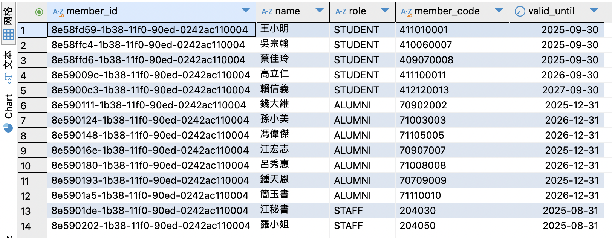
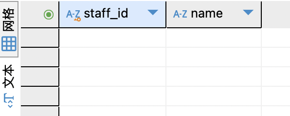

### 子查詢與 EXISTS 效能比較
#### 題目 2-1
**找出「本月內沒有任何進場記錄」的會員**
* 分別以 `NOT EXISTS`、`NOT IN`、以及 `LEFT JOIN ... IS NULL` 實現。
* 使用 `EXPLAIN` 分析三種寫法的執行計畫，並比較其效能差異。

**解題思路：**
* 透過「本月內」這個條件，測試子查詢與 Join 在有限區間資料時的執行模式。
* 可留意每種寫法是否利用到索引，或在查詢計畫中是否出現全表掃描。

**SQL 撰寫**
1. `NOT EXISTS`
* Members (m)：全表掃描（type: ALL），rows: 30。
* Registrations（r）：全表掃描（type: ALL），rows: 125。
* 執行時間（EXPLAIN）：約 5,719 ms。
```sql=
SELECT m.*
FROM Members m
WHERE NOT EXISTS (
    SELECT 1
    FROM Registrations r
    WHERE r.member_id = m.member_id
      AND r.entry_time IS NOT NULL
      AND YEAR(r.entry_time) = YEAR(CURDATE())
      AND MONTH(r.entry_time) = MONTH(CURDATE())
);
```

2. `NOT IN`
* Members (m)：全表掃描（type: ALL），rows: 30。
* Registrations（r）：全表掃描（type: ALL），rows: 125。
* 執行時間（EXPLAIN）：約 7,302 ms。
```sql=
SELECT m.*
FROM Members m
WHERE m.member_id NOT IN (
    SELECT r.member_id
    FROM Registrations r
    WHERE r.entry_time IS NOT NULL
      AND YEAR(r.entry_time) = YEAR(CURDATE())
      AND MONTH(r.entry_time) = MONTH(CURDATE())
);
```

3. `LEFT JOIN ... IS NULL`
* Members (m)：全表掃描（type: ALL），rows: 30。
* Registrations（r）：以 member_id 為條件（type: ref），rows: 5，使用索引。
* 執行時間（EXPLAIN）：約 5,222 ms。
```sql=
SELECT m.*
FROM Members m
LEFT JOIN Registrations r
  ON m.member_id = r.member_id
  AND r.entry_time IS NOT NULL
  AND YEAR(r.entry_time) = YEAR(CURDATE())
  AND MONTH(r.entry_time) = MONTH(CURDATE())
WHERE r.registration_id IS NULL;
```

**執行結果**



#### 題目 2-2
**列出「至少曾參加自己擔任教練課程」的教練清單**
* 教練必須同時出現在 `StaffAccounts`，並在 `Courses` 內綁定為該課程 `coach`。
* 他至少有一次以會員身份（在 `Members`）報名自己所帶的課程 (`Registrations`)。
* 請使用 `EXISTS` 撰寫查詢，需特別留意同一人員在 `Members`、`StaffAccounts` 兩表都可能有紀錄。

**解題思路：**
* 此題是子查詢 (尤其 `EXISTS`) 的實務應用：同一個人同時在不同表有角色（教練 / 會員）的識別。
* 可額外思考若教練帳號與會員帳號在資料上如何對應（例如身分證字號、email…），以便正確連結。

**SQL 撰寫**
```sql=
SELECT s.staff_id, s.name
FROM StaffAccounts s
WHERE s.role = 'COACH'
  AND EXISTS (
    SELECT 1
    FROM Members m
    JOIN Registrations r ON r.member_id = m.member_id
    JOIN CourseSchedules cs ON cs.course_schedule_id = r.course_schedule_id
    JOIN Courses c ON c.course_id = cs.course_id
    WHERE m.member_id = s.staff_id   
      AND c.coach_id = s.staff_id  
    );
```

**執行結果**

