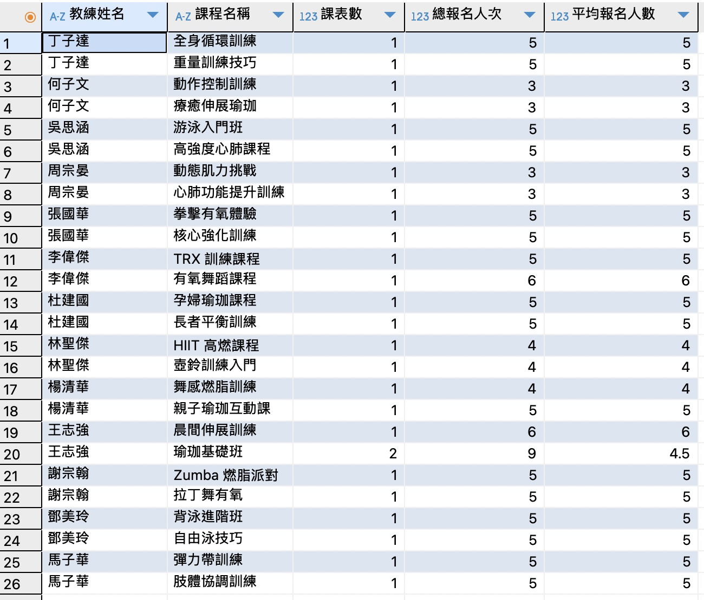
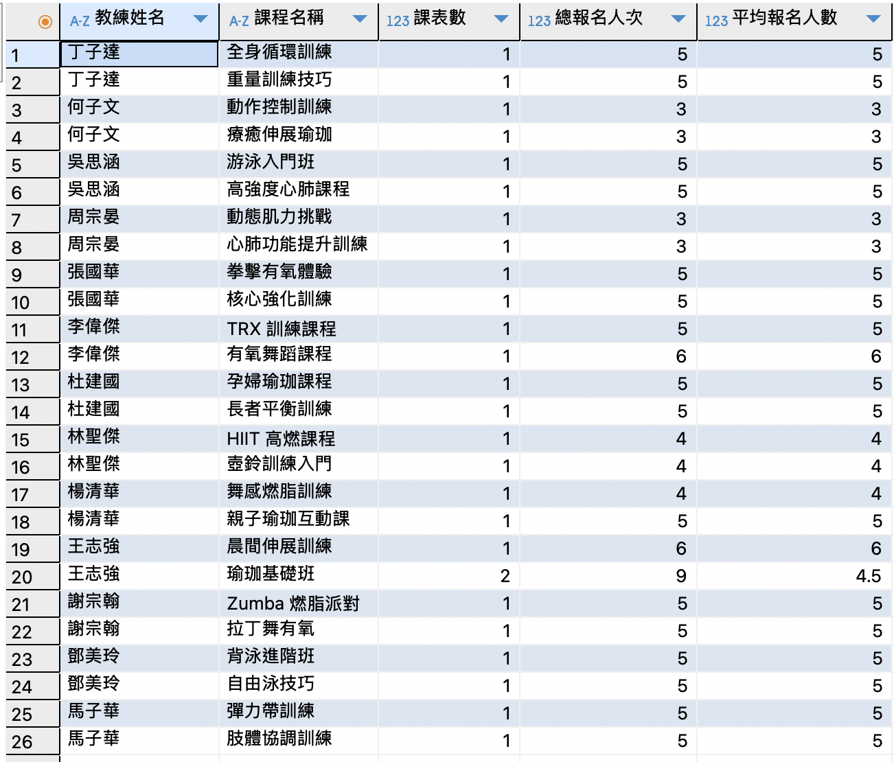
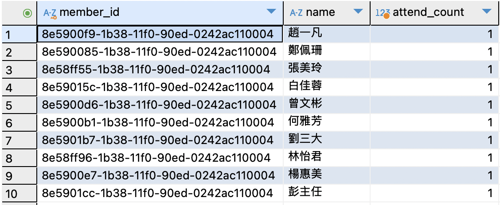

### 聚合與索引優化練習
#### 題目 3-1
**列出每位教練、其課程、課次總數，及平均每場報名人數**
* 需 `JOIN Courses`、`StaffAccounts`、`CourseSchedules`、`Registrations` 四表。
* 輸出欄位：教練姓名、課程名稱、課表數、總報名人次、平均報名人數。
* 請思考：在 `JOIN` 及 `GROUP BY` 的排程與順序上，哪種組合能夠最佳化群組速度？若
* 料量龐大，可考慮在哪些欄位上建立（複合）索引？

**解題思路：**
* 此題練習多表聯結與聚合的基礎；同時引導學員思考索引建在哪些表、哪幾個欄位可以有效提升查詢效能。
* 可結合 `EXPLAIN` 分析聚合前後的資料量，與索引使用情況。

**SQL 撰寫**
```sql=
SELECT
    sa.name AS 教練姓名,
    c.name AS 課程名稱,
    COUNT(DISTINCT cs.course_schedule_id) AS 課表數,
    COUNT(r.registration_id) AS 總報名人次,
    IFNULL(ROUND(COUNT(r.registration_id) / NULLIF(COUNT(DISTINCT cs.course_schedule_id), 0), 2), 0) AS 平均報名人數
FROM
    Courses c
    JOIN StaffAccounts sa ON c.coach_id = sa.staff_id
    JOIN CourseSchedules cs ON cs.course_id = c.course_id
    LEFT JOIN Registrations r ON r.course_schedule_id = cs.course_schedule_id
GROUP BY
    sa.name, c.name
ORDER BY
    sa.name, c.name;
```

**執行結果**


**實務最佳組合建議**
1. **JOIN 規劃——小表先、大表後**
    * 先從資料表筆數較少的開始 -> Courses JOIN StaffAccounts 篩出教練與課程對應
    * 接著是中等筆數 -> JOIN CourseSchedules
    * 最後是最多筆數 -> LEFT JOIN Registrations
2. **GROUP BY**
    * 以教練和課程為分群主軸，建議用 Coach_ID, Course_ID
    * 只要查詢時不連帶出非聚合/分群欄位（例如不要 GROUP BY 超多文字欄），可提升效率
3. **如果報名量極大（Registrations）**
* 用子查詢先彙總每課表（課次）的報名數，再與課程、教練 JOIN，這可大幅減少 JOIN 時拉出的資料量、加速 Group By

**優化後 SQL 撰寫**
```sql=
SELECT 
    sa.name AS 教練姓名,
    c.name AS 課程名稱,
    COUNT(cs.course_schedule_id) AS 課表數,
    IFNULL(SUM(session_count.報名人次), 0) AS 總報名人次,
    IFNULL(ROUND(SUM(session_count.報名人次)/COUNT(cs.course_schedule_id), 2), 0) AS 平均報名人數
FROM
    Courses c
    JOIN StaffAccounts sa ON c.coach_id = sa.staff_id
    JOIN CourseSchedules cs ON cs.course_id = c.course_id
    LEFT JOIN (
        SELECT course_schedule_id, COUNT(*) AS 報名人次
        FROM Registrations
        GROUP BY course_schedule_id
    ) session_count ON session_count.course_schedule_id = cs.course_schedule_id
GROUP BY
    sa.name, c.name
ORDER BY
    sa.name, c.name;
```

**優化後 SQL 執行結果**
> 會跟優化前的結果一樣



**資料量龐大時可建的索引**
* `CourseSchedules `為加速 `JOIN`，針對 [course_id] 建立索引，最常用組合為：`(course_id)`
* `Registrations`:若同時會用到過濾條件與 `JOIN`，可考慮(`course_schedule_id`, `register_time`)
* 如果常「批次刪除某課表的報名」，可考慮(`course_schedule_id`, `registration_id`)
* `CourseSchedules`:(`course_id`, `course_schedule_id`) 有助於查課程下所有課表等需求

#### 題目 3-2
**找出三個月內報到次數最多的 10 名會員（member_id, name, 出席次數）**
* 請避免不必要的子查詢，儘量以 JOIN 搭配 GROUP BY 完成。
* 思考有哪些欄位可加索引，以提升此查詢效能。

**解題思路：**
* 此題結合了時間區間篩選（3 個月內）與聚合 (COUNT)。
* 排名前 10 名可使用 DBMS 內建的排序與 LIMIT 功能（如 `ORDER BY cnt DESC LIMIT 10`）。
* 需留意查詢條件與索引欄位的配合度。

**SQL 撰寫**
```sql=
SELECT m.member_id, m.name, COUNT(r.entry_time) AS attend_count
FROM Members m
JOIN Registrations r ON m.member_id = r.member_id
WHERE r.entry_time IS NOT NULL
  AND r.entry_time >= DATE_SUB(CURDATE(), INTERVAL 3 MONTH)
GROUP BY m.member_id, m.name
ORDER BY attend_count DESC
LIMIT 10;
```
**執行結果**


**可增加的索引（可提升查詢效率）**
* 給 `Registrations` 表加複合索引：
`CREATE INDEX idx_registrations_member_entry ON Registrations (member_id, entry_time);`
    * 這條複合索引可以同時優化 `JOIN（member_id）`、出席時間過濾`（entry_time）、GROUP BY` 用途，若要再擴充查詢時 (例如篩選 `course_schedule_id`)，可再根據查詢調整索引順序。