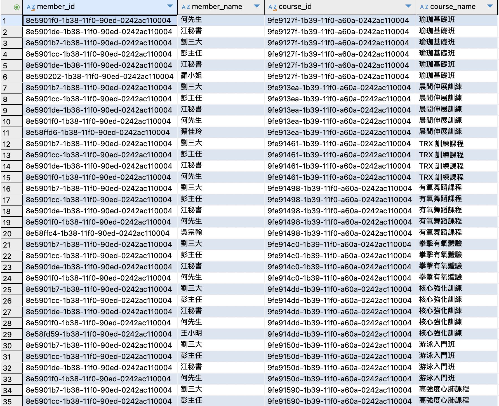
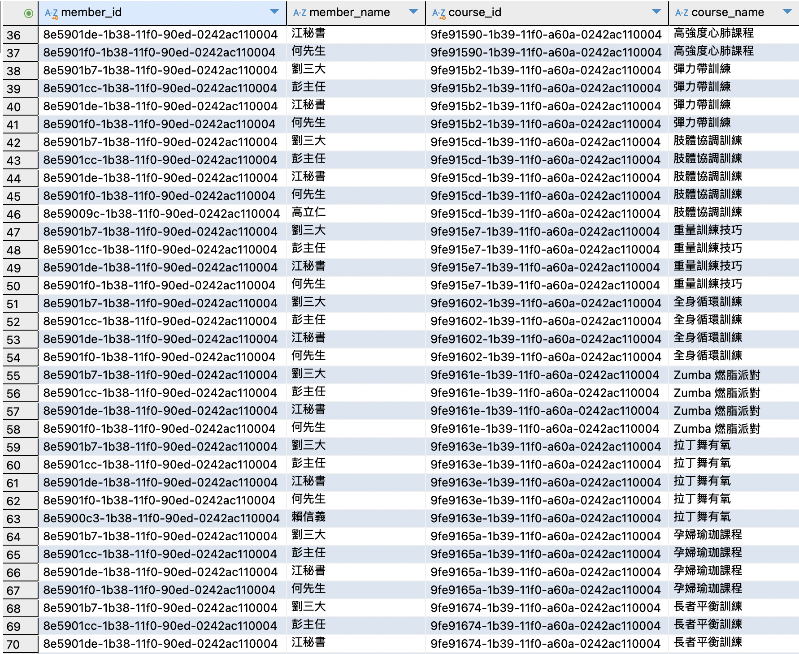
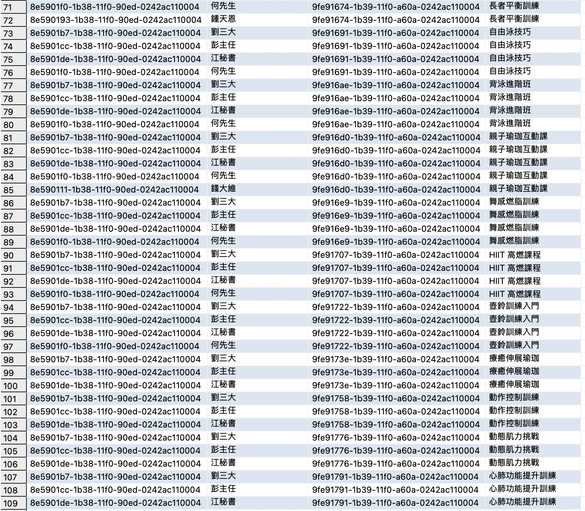
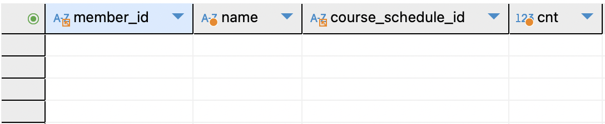
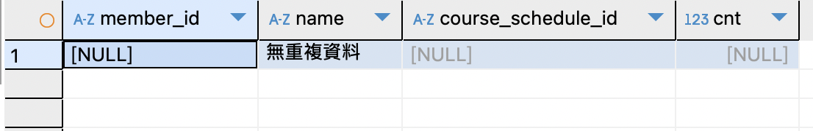

### 三值邏輯與重複/例外資料查核
#### 題目 4-1
**查出 entry_time 為 NULL 的報名紀錄，並顯示會員與課程名稱**
* 表示該會員雖然預約了，但尚未實際進場或資料遺漏。
* 注意 `IS NULL` 的用法，並透過 `JOIN` 取出該會員及課程完整資訊。

**解題思路：**
* 透過此題複習三值邏輯中 `NULL` 的概念，以及正確使用 `IS NULL`。
* 現實場景中，這類查詢常用於檢查缺漏或異常記錄，為資料清理和報表稽核的常見需求。

**SQL 撰寫**
```sql=
SELECT 
  m.member_id,
  m.name AS member_name,
  c.course_id,
  c.name AS course_name
FROM Registrations r
JOIN Members m ON r.member_id = m.member_id
JOIN CourseSchedules cs ON r.course_schedule_id = cs.course_schedule_id
JOIN Courses c ON cs.course_id = c.course_id
WHERE r.entry_time IS NULL;
```

**執行結果**




#### 題目 4-2
**檢查同一會員在同一時段報名多次的情況**
* 若資料結構允許重複，找出 `member_id`, `name`, `course_schedule_id` 與「報名次數 (cnt) > 1」的紀錄。
* 若沒有任何重複，請顯示「無重複資料」。

**解題思路：**
* 練習使用 `GROUP BY ... HAVING cnt > 1` 或自我聯結來檢查重複。
* 了解真實世界的資料表設計若允許重複報名時，可能需要加一些機制避免問題；同時也能讓學員體會為何在部分欄位上應考慮使用 UNIQUE 限制或複合索引。

**SQL 撰寫**
1. 不會顯示出來**無重複資料**
```sql=
SELECT
    r.member_id,
    m.name,
    r.course_schedule_id,
    COUNT(*) AS cnt
FROM
    Registrations r
    JOIN Members m ON r.member_id = m.member_id
GROUP BY
    r.member_id,
    r.course_schedule_id
HAVING
    COUNT(*) > 1;
```
2. 會顯示出來**無重複資料**
```sql=
SELECT
    member_id,
    name,
    course_schedule_id,
    cnt
FROM (
    SELECT
        r.member_id,
        m.name,
        r.course_schedule_id,
        COUNT(*) AS cnt
    FROM
        Registrations r
        JOIN Members m ON r.member_id = m.member_id
    GROUP BY
        r.member_id,
        r.course_schedule_id
    HAVING
        COUNT(*) > 1
) t
UNION ALL
SELECT
    NULL, '無重複資料', NULL, NULL
WHERE NOT EXISTS (
    SELECT 1
    FROM Registrations r
    GROUP BY r.member_id, r.course_schedule_id
    HAVING COUNT(*) > 1
);
```

**執行結果**
1. 不會顯示出來**無重複資料**


2. 會顯示出來**無重複資料**
