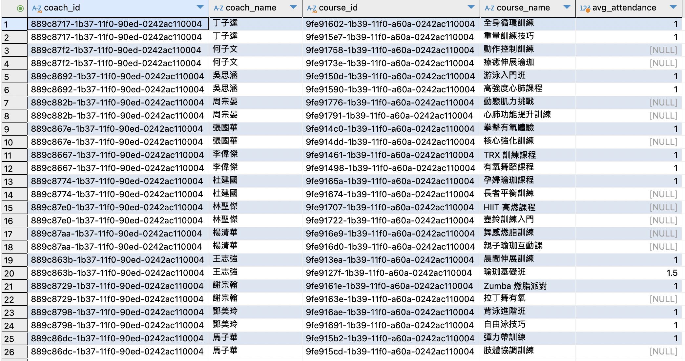
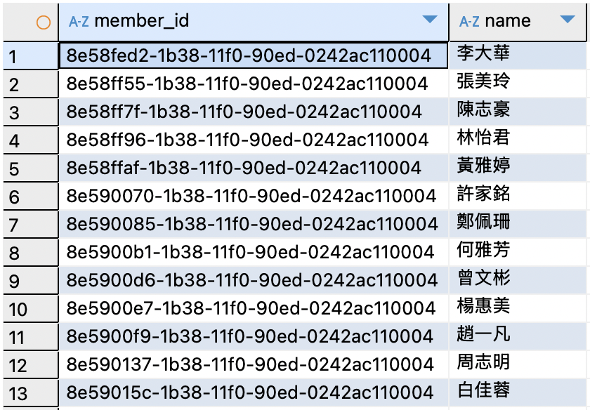

### 多表關聯與綜合查詢效能
#### 題目 5-1
**列出每位教練「本月」課程所有時段的平均出席人數**
* 請 `JOIN StaffAccounts`、`Courses`、`CourseSchedules`、`Registrations`，並利用 `GROUP BY` 教練、課程。
* 使用 `EXPLAIN` 分析你的寫法，以觀察在大資料量下的索引使用情況或可能的全表掃描。
* 思考：可在哪些欄位加索引來優化這個多表 `JOIN` 與群組運算？

**解題思路：**
* 再度強化多表聯結、聚合與時間區間 (本月) 的組合。
* 引導學員動手測試多種索引配置，例如 (`coach_id`, `course_id`, `schedule_date`) 等複合索引，是否能顯著降低掃描量。

**SQL 撰寫**
```sql=
SELECT
    sa.staff_id AS coach_id,
    sa.name AS coach_name,
    c.course_id,
    c.name AS course_name,
    AVG(attendance_count) AS avg_attendance
FROM
    StaffAccounts sa
    JOIN Courses c ON sa.staff_id = c.coach_id
    JOIN CourseSchedules cs ON c.course_id = cs.course_id
    LEFT JOIN (
        SELECT
            course_schedule_id,
            COUNT(*) AS attendance_count
        FROM
            Registrations
        WHERE
            entry_time IS NOT NULL
        GROUP BY
            course_schedule_id
    ) reg_count ON cs.course_schedule_id = reg_count.course_schedule_id
WHERE
    sa.role = 'COACH'
    AND YEAR(cs.start_time) = YEAR(CURDATE())
    AND MONTH(cs.start_time) = MONTH(CURDATE())
GROUP BY
    sa.staff_id, c.course_id
ORDER BY
    sa.name, c.name;
```

**執行結果**



**EXPLAIN 分析**
1. **CourseSchedules（cs）表：**
    * type: ALL（全表掃描）
    * possible_keys: course_id（理論可用 course_id 索引，但未被選用）
    * Extra: Using where; Using temporary; Using filesort（有篩選、建立暫存表格和檔案排序）
2. **Courses（c）表：**
    * type: eq_ref（良好，透過主鍵等值關聯）
    * possible_keys: PRIMARY, coach_id
    * key: PRIMARY
3. **StaffAccounts（sa）表：**
    * type: eq_ref（良好，透過主鍵等值關聯）
4. **Subquery （reg_count）：**
    * type: ref（有用到索引 key0）
5. **Registrations（子查詢 DERIVED）：**
    * type: ALL（全表掃描）
    * possible_keys: course_schedule_id
    * key: null（未用索引）

**可在哪些欄位加索引來優化這個多表 JOIN 與群組運算？**
* 只要針對實際查詢「JOIN 串接鍵」與「WHERE 條件欄位」加好索引，就能明顯減少全表掃描，提高 JOIN 與 GROUP BY 的效率，尤其在資料量變多時更為明顯。

#### 題目 5-2
**列出一年內「從未缺席任何一場已報名時段」的學員名單（全勤會員）**
* 條件：每一筆 `Registrations` 都有 `entry_time`（不為 `NULL`）。
* 若只使用 `NOT EXISTS` 或 `NOT IN` 實作，何者效能較佳？是否有更好的方法？
* 試想：可在 `Registrations` 或其他表格上建何種索引，來加速查詢？

**解題思路：**
* 此題與全勤概念掛鉤，重點在於找出「沒有任何缺席紀錄」。
* 思考：`NOT EXISTS` vs. `NOT IN` 在大資料量中，哪種方式的效能更穩定？建索引時，時間欄位 (`report_date` / `schedule_date`) 與 `member_id`、`course_id` 等應如何搭配？

**SQL 撰寫**
```sql=
SELECT m.member_id, m.name
FROM Members m
JOIN Registrations r ON m.member_id = r.member_id
WHERE r.register_time >= DATE_SUB(CURDATE(), INTERVAL 1 YEAR)
GROUP BY m.member_id, m.name
HAVING SUM(r.entry_time IS NULL) = 0;
```

**執行結果**



**使用 `NOT EXISTS` 或 `NOT IN` 實作，何者效能較佳？**
* `NOT EXISTS` 一般來說效能更可靠因為它通常能利用外層查詢索引，遇到第一筆符合條件（即有缺席記錄）時就會早停（anti-join nexus），且對於子查詢結果量很大或含 `NULL` 的情境下，`NOT IN` 容易有不預期的行為（`NOT IN` 遇到 `NULL`，整個結果都會是 `UNKNOWN`，可能導致查詢失敗）。

**是否有更好的方法？**
* 想查詢「沒有任何缺席」的會員，更好的方法就是使用 `NOT EXISTS` ，最穩當且易於理解
* SQL 撰寫：
    > 執行結果和上圖結果一樣
    * 第一個 `EXISTS` 確保「這個會員過去一年內有報名」。
    * 第二個 `NOT EXISTS` 排除「這個會員有任何一次缺席」。
```sql=
SELECT m.member_id, m.name
FROM Members m
WHERE EXISTS (
    SELECT 1 FROM Registrations r
    WHERE r.member_id = m.member_id
      AND r.register_time >= DATE_SUB(CURDATE(), INTERVAL 1 YEAR)
)
AND NOT EXISTS (
    SELECT 1 FROM Registrations r
    WHERE r.member_id = m.member_id
      AND r.register_time >= DATE_SUB(CURDATE(), INTERVAL 1 YEAR)
      AND r.entry_time IS NULL
);
```

**可在 Registrations 或其他表格上建何種索引，來加速查詢？**
* 建議對 `Registrations` 建的索引為：`CREATE INDEX idx_reg_member_regtime ON Registrations(member_id, register_time);`